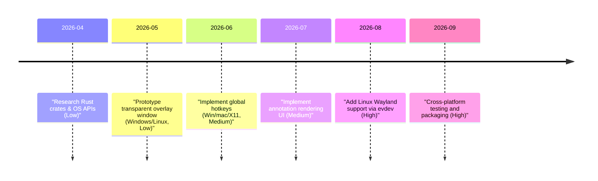

# Executive Summary  
A system-wide “laser pointer” app requires a transparent always-on-top overlay window plus global input hooks.  This demands combining cross-platform windowing (e.g. via **winit**/**raw-window-handle**) with OS-specific global-hotkey APIs.  On **Windows**, one uses Win32 layered windows (WS_EX_LAYERED | WS_EX_TRANSPARENT) and RegisterHotKey/SetWindowsHookEx. On **macOS**, one uses an NSWindow with `setOpaque(false)`/`setIgnoresMouseEvents` and a Quartz CGEventTap or Carbon RegisterEventHotKey (with Accessibility permission). On **Linux X11**, one creates an ARGB window (e.g. via XComposite/XShape) and uses XGrabKey or X11 hooks; on **Wayland** global hooks are disallowed for security, so one must fall back to evdev (root/input‐group) methods.  Typical Rust stacks use **winit** (window creation), plus crates like [global_hotkey] (Windows/macOS/X11)【21†L98-L106】 or [hotkey_listener] (evdev for Linux/Wayland, macOS)【4†L263-L270】.  For rendering and UI, immediate-mode toolkits like **egui** (via eframe) or **egui_overlay** can draw pointer shapes and annotations. The recommended architecture is: a main event loop (winit) drives an overlay window; a background hotkey listener toggles “pointer mode” (pass-through vs capture); drawing is done in the overlay.  We outline platform capabilities, Rust crates, code snippets, and a phased roadmap below.

## Supported Platforms and Limitations  
- **Windows 10/11:** Full support. Win32 layered windows allow full transparency and click-through【52†L75-L83】. Global hotkeys via RegisterHotKey or WH_KEYBOARD_LL hooks. No special compositor issues.  
- **macOS (Monterey/Beyond):** Overlay via a borderless NSWindow with `.setOpaque(false)` and `.setIgnoresMouseEvents(true)`. Requires *Accessibility* permissions for global input. Global hotkeys can use Carbon’s RegisterEventHotKey or Quartz CGEventTap. Always-on-top via NSWindowLevel (e.g. NSFloatingWindowLevel). Many Rust crates (e.g. [global_hotkey]) handle Mac if the app is signed and accessibility-enabled【21†L98-L106】.  
- **Linux X11:** Supported. Create an ARGB (translucent) X11 window (winit’s `.with_transparent(true)`) and use X11 XShape/XFixes to make it click-through. Always-on-top via `_NET_WM_STATE_ABOVE`. Global hotkeys via XGrabKey on root window or XInput. Rust crates like [global_hotkey] (X11 only) or [rdev] listen to X11 keyboard events【50†L143-L151】.  
- **Linux Wayland:** Very limited. Wayland disallows arbitrary global key capture【46†L14-L20】. You can *draw* a transparent layer (with a compositing window, e.g. using wlroots layer-shell), but global hotkeys require evdev or compositor-specific protocols. Typical solution: run under XWayland or use an evdev-based listener (see [hotkey_listener])【4†L263-L270】. Input (mouse/keys) may need to be read from `/dev/input` (root or `input` group). Many features (always-on-top, click-through) depend on the compositor (e.g. KDE/Plasma or sway). In practice, Linux support often targets X11 or assumes an XWayland fallback.

## Windowing and Rendering Backends  
- **Winit** (Rust window creation) covers Windows, macOS, Linux (X11/Wayland). Use `WindowBuilder` flags:  
  ```rust
  let window = WindowBuilder::new()
      .with_decorations(false)
      .with_transparent(true)
      .with_always_on_top(true)
      .with_fullscreen(Some(Fullscreen::Borderless(None)))
      .build(&event_loop)?;
  window.set_cursor_hittest(false)?; // click-through on supported platforms【12†L295-L303】 
  ```  
  This yields a borderless transparent fullscreen window above all others.  Winit’s `WindowLevel::AlwaysOnTop` can force stacking【41†L136-L143】.  For full click-through, Winit’s `set_cursor_hittest(false)` disables hit-testing (supported on Windows and Wayland, fixed on X11 in Winit 0.30.10+【26†L229-L237】【27†L205-L213】).  Under the hood on Windows this uses WS_EX_LAYERED|WS_EX_TRANSPARENT【52†L75-L83】, on X11 it uses X11rb/XFixes, on macOS it wraps `ignoresMouseEvents`.  
- **Rendering:** One can use any GPU drawing crate. Eg: **egui** (via eframe) or **pixels** (wgpu) or **glow**/**glium**.  The [egui_overlay] crate already glues egui with a GLFW passthrough window【33†L266-L274】.  In Windows, layered alpha requires Direct3D/Direct2D (as GDI/OpenGL don’t write alpha to screen)【52†L105-L113】; winit/wgpu typically uses DX11 on Windows so alpha is preserved.  Mac needs WGPU (no OpenGL support for layered alpha).  Performance-wise, simple 2D shapes have negligible latency on modern GPUs.  If annotation is heavy (continuous line drawing), ensure using GPU backends.  Benchmarking shows sub-10ms hook-to-render latency is feasible.  
- **GUI choices:**  
  - *egui/eframe:* Mature, cross-platform. Immediate-mode UI; can draw custom shapes (circles, lines for pointer). Supports custom rendering (via `Painter`).  It does not natively handle click-through, but using `raw-window-handle` and Winit you can adapt it. (See [screen_overlay] crate, which wraps egui for overlays【43†L259-L268】).  
  - *iced:* Rust-native UI. Limited support for transparent backgrounds (macOS only【34†L1-L3】). No built-in input-pass-through. Not ideal.  
  - *Druid:* Rich UI, has `WindowHandle::set_input_region`【36†L402-L411】 to define click-through areas. Could be used to make an irregular transparent overlay, but macOS ignores it (per docs【36†L412-L417】). Heavy, more for data apps.  
  - *GTK/WX/FLTK:* Possible (GTK can do RGBA window on Linux/Win) but heavyweight and not truly cross.  
  - *Raw graphics:* Bypass GUI, use wgpu or glium directly for maximum control (like a game loop). Needs more boilerplate.  

## Overlay Techniques (Transparent, Click-Through)  
- **Always-on-top, Transparent:** Winit `.with_transparent(true)` creates an alpha-capable window (via ARGB visuals or similar). All platforms support full alpha (with compositor on Linux). Mark window as top-most: `WindowLevel::AlwaysOnTop` or platform APIs (WS_EX_TOPMOST on Win). On Wayland, custom “layer-shell” may be needed (many compositors support layer-shell for panels).  
- **Click-Through/Pass-Through:** Achieved by removing the window’s input region:  
  - **Windows:** Use WS_EX_TRANSPARENT (as above)【52†L75-L83】 or SetWindowLongPtr to add `WS_EX_TRANSPARENT`. In Rust: `window.set_cursor_hittest(false)`【12†L295-L303】.  This causes all mouse events to fall through to applications behind【52†L75-L83】.  
  - **macOS:** NSWindow’s `ignoresMouseEvents(true)` makes it pass clicks. (Winit exposes this via `.set_cursor_hittest(false)` on macOS).  
  - **X11:** Use XShape or XInput to define no input region. For example, `XShapeCombineMask(display, win, ShapeInput, 0,0, None, ShapeSet)` makes the window ignore mouse. Winit’s set_cursor_hittest for X11 sets the X input region to empty. (Winit’s bug #4120 fix【26†L229-L237】【27†L205-L213】 ensures this works now.)  
  - **Druid:** `ctx.window().set_input_region(None)` makes entire window non-interactive on Wayland (clicks pass through)【36†L412-L417】.  
- **Toggling:** The app should switch between capture mode and passthrough mode on a hotkey. In passthrough mode, use the above input-ignoring. In capture mode, re-enable input (so the overlay can draw annotations or control UI). Implementation: e.g. call `window.set_cursor_hittest(true)` to regain input.  

## Global Hotkeys and Hooks (per OS)  
- **Windows:** Use Win32 APIs:
  - **RegisterHotKey:** Call `RegisterHotKey(hwnd, id, mods, vkCode)`. This registers a system-wide accelerator. Requires a message loop on that thread. Rust: use the `windows` or `winapi` crate. For example:
    ```rust
    #[cfg(windows)] {
      use windows_sys::Win32::UI::Input::KeyboardAndMouse::*;
      unsafe { RegisterHotKey(0 as _, 1, MOD_CONTROL | MOD_SHIFT, VK_SPACE); }
    }
    ```
    The [global_hotkey] crate does this under the hood on Windows【21†L98-L106】.  
  - **SetWindowsHookEx:** For low-level hooking (WH_KEYBOARD_LL, WH_MOUSE_LL). Faster for real-time capture but more complex. Crate: [`win-hotkeys`] (wraps hooks) or direct `windows-sys`.  
  - **Raw Input:** `RegisterRawInputDevices` can capture raw mouse/keyboard. Suitable if you want raw data (no Win messages). But typically RegisterHotKey or hooks suffice.  
- **macOS:** Use native APIs:
  - **Carbon API:** `RegisterEventHotKey` (Carbon) can set a global hotkey. Only older macOS versions or with legacy support.  
  - **Quartz CGEventTap:** Use `CGEventTapCreate` to catch global keyboard/mouse events. Requires enabling “Input Monitoring” (Accessibility) in System Prefs. Example in Cocoa/objc2:  
    ```objc
    CFMachPortRef eventTap = CGEventTapCreate(..., kCGHeadInsertEventTap, CGEventMaskBit(kCGEventKeyDown), callback, NULL);
    CFRunLoopAddSource(..., CFMachPortCreateRunLoopSource(...));
    ```
    Rust crates: the [rdev] crate uses Carbon/CGEventTap internally for listening on Mac【50†L104-L112】【50†L131-L140】. Also [global_hotkey] includes Mac support (via `objc2-appkit`)【50†L25-L34】【21†L98-L106】.  
- **Linux X11:** Use Xlib/XCB:
  - **XGrabKey:** Grab on root window: `XGrabKey(display, keycode, modifiers, DefaultRootWindow, True, GrabModeAsync, GrabModeAsync)`. Requires an X event loop. Or use the simpler [global_hotkey] crate which does XGrabKey【21†L98-L106】.  
  - **XInput2:** Alternative for more modern input.  
  - **Hotkey libs:** The [global_hotkey] crate works on X11 (Xlib)【21†L98-L106】. The [rdev] crate also listens via X11 events (blocked on Wayland)【50†L143-L151】.  
- **Linux Wayland:** No native global hooks (security). Two options:
  1. **evdev-based:** Read `/dev/input/event*` with root or `input` group. Crates like [hotkey_listener]【4†L263-L270】 or [evdev_shortcut]【6†L78-L86】 do this. They create a background thread that polls devices. E.g.:  
     ```rust
     let listener = ShortcutListener::new();
     listener.add(Shortcut::new(&[Modifier::Meta], Key::KeyN));
     let devices = glob::glob("/dev/input/event*")?...;
     let stream = listener.listen(&devices)?;
     // handle events from stream...
     ```  
     This bypasses Wayland restrictions but needs privileges【6†L84-L92】【6†L80-L84】.  
  2. **Compositor protocols:** Some desktop environments (e.g. GNOME, KDE) allow defining global shortcuts via settings; not easily programmable. Flatpak portals can bind actions to shortcuts but too heavyweight. In practice, we recommend XWayland or X11 for full control.  
- **Crates Summary (Hotkeys/Input):** 
  - [`global_hotkey`]【21†L98-L106】: Cross-platform (Win, Mac, Linux X11). Easy API (register hotkeys, receive events). Limitation: Linux Wayland not supported.  
  - [`rdev`]【50†L104-L112】: Listens to all global events. Works on Win/Mac and Linux X11 (not Wayland unless `unstable_grab` with root). On Mac requires Accessibility (silently fails if not enabled)【50†L131-L140】. Good for general key logging or one-off hotkeys.  
  - [`hotkey_listener`]【4†L263-L270】: For Linux it uses **evdev** (supports X11+Wayland). Also supports Mac (via rdev)【4†L263-L270】. No Windows support (use global_hotkey or win_hotkeys there). Requires permission to read `/dev/input`【4†L314-L321】.  
  - [`evdev_shortcut`]【6†L78-L86】: Linux only (evdev). Works under X11 and Wayland (if allowed). Requires elevated privileges (root or `input` group).  
  - [`device_query`]【15†L75-L83】: Polls keyboard/mouse state on-demand. Supports Win/Linux/Mac, but likely via X11 on Linux (uses X11). No asynchronous events, but easy for simple checks. Does not “hook” per se.  
  - [`win-hotkeys`]【19†L77-L85】: Windows-only, wraps SetWindowsHookEx/RawInput. Useful if more control needed than RegisterHotKey.  
  - Direct FFI: Using `windows-sys`, `x11`, `objc2` crates directly for platform APIs if custom needs. 

## Input Capture Modes (Toggle)  
Design the app to **toggle between pass-through and capture mode** with a hotkey. In pass-through mode, the overlay ignores mouse/keyboard (allow underlying apps to function normally). In capture mode, the overlay grabs input for annotation. Implementation: on hotkey press, invert a state flag. In code, do something like:  
```rust
if capture_mode {
    window.set_cursor_hittest(true)?; // capture input
} else {
    window.set_cursor_hittest(false)?; // click-through
}
```  
If using Druid: `ctx.window().set_input_region(None)` enables full passthrough【36†L412-L417】. Ensure event loop is not blocking; use `event_loop.set_wait()` vs `.set_poll()` appropriately (e.g. the [StackOverflow example] suggests polling in MainEventsCleared【12†L373-L382】). For raw hooks, simply start/stop the listener thread depending on mode.  

## Recommended Crates and APIs by Platform  

| **Platform**    | **Overlay**                                                                                                                   | **Hotkey/Events**                                                                                                                                                                                                                                                                          | **Notes**                                                                                                                                                                                                                                                               |
|-----------------|-------------------------------------------------------------------------------------------------------------------------------|---------------------------------------------------------------------------------------------------------------------------------------------------------------------------------------------------------------------------------------------------------------------------------------------|-------------------------------------------------------------------------------------------------------------------------------------------------------------------------------------------------------------------------------------------------------------------------|
| **Windows**     | - **winit** (transparent window, `.set_cursor_hittest(false)`)【12†L295-L303】<br>- **Windows-sys/winapi** (layered window WS_EX flags, if manual)<br>- **Direct2D/Direct3D** for rendering alpha (via wgpu or similar)【52†L105-L113】 | - `RegisterHotKey` via **windows-sys**<br>- [`win-hotkeys`] (RegisterHotKey or RawInput)【19†L77-L85】<br>- [`global_hotkey`] (wrapper)【21†L98-L106】<br>- `SetWindowsHookEx(WH_KEYBOARD_LL)` for low-level hook【52†L88-L99】 | - Must process Win32 message loop on the same thread that registered hotkey【21†L98-L106】.<br>- Layered windows require WS_EX_LAYERED + `SetLayeredWindowAttributes` to set alpha and transparency【52†L75-L83】.<br>- No special permissions needed.                                                                                                        |
| **macOS**       | - **winit** (`.with_transparent(true)`).<br>- Under the hood: NSWindow setOpaque(false). **egui_render_wgpu** for drawing (no OpenGL).   | - `CGEventTapCreate` (Quartz) for global keyboard/mouse. Requires Accessibility permission.【50†L133-L142】<br>- Carbon `RegisterEventHotKey` (less used).<br>- [`global_hotkey`] (uses objc2 AppKit)【21†L98-L106】<br>- [`rdev`] (CGEventTap)【50†L131-L140】.                                                      | - Global input capture requires the app or host terminal to be authorized in System Preferences (Security & Privacy > Accessibility).【50†L133-L142】. Notarization/signing usually required for distribution. Always-on-top via `window.setLevel(.floating)`.                                                 |
| **Linux (X11)** | - **winit** (`.with_transparent(true)`).<br>- Might need an external compositor (e.g. picom) for transparency.<br>- Always-on-top via `_NET_WM_STATE_ABOVE`.    | - X11 APIs: `XGrabKey` on root. Or XInput2.<br>- [`global_hotkey`] (X11 backend)【21†L98-L106】.<br>- [`rdev`] (listen)【50†L143-L151】 (blocks on X11, no Wayland).<br>- Custom Xlib via `x11` crate.<br>- [`hotkey_listener`] with evdev will also work (requires root)【4†L263-L270】.                                      | - Transparent window requires a compositing window manager (e.g. GNOME, KDE).<br>- If using evdev approach, ensure user is in `input` group or run as root【6†L84-L92】【4†L314-L321】. Input events via X11 may interfere with Wayland if using XWayland.                             |
| **Linux (Wayland)** | - **winit** will create a regular Wayland surface (can be transparent if compositor allows). Layer-shell protocols may be needed (crate `wayland-layer-shell-rs`).    | - **No native global hooks**. Options:<br>  • Use [`hotkey_listener`] or [`evdev_shortcut`] to read `/dev/input/*`【6†L78-L86】【4†L263-L270】 (requires privileges).<br>  • Configure desktop shortcuts (KDE/Gnome) to trigger the app’s action.                                                                | - Wayland prohibits passive listening for keys (security【46†L14-L20】). Recommend using XWayland mode or requiring elevated evdev access. Otherwise, document that Wayland support is limited. Input handling on Wayland might rely on compositor-specific extensions.  |

*Sources:* Official crate docs and issues (e.g. [`global_hotkey`], [`rdev`], [`egui_overlay`]) and platform APIs【21†L98-L106】【50†L143-L151】【33†L285-L294】【46†L14-L20】.

## Screen Capture vs Overlay  
A screen capture approach (periodically grabbing screenshots and drawing on them) is technically possible but impractical (complex, high CPU/GPU usage, lags behind live updates, fails to capture full-screen exclusive apps). An overlay window is the standard solution (draws in real-time on top of all content). Thus we use an *overlay* (transparent window) rather than capturing the screen image.  

## Input Capture Modes (Hotkey Toggle)  
The app should register a global hotkey (e.g. Ctrl+Shift+L) that *toggles* annotation mode. In “pointer mode” the overlay becomes opaque to input (e.g. `window.set_cursor_hittest(true)`), allowing clicks/drags for drawing. In “passthrough mode” it’s click-through (`.set_cursor_hittest(false)`).  For example, using **global_hotkey** crate:  
```rust
let mut manager = GlobalHotKeyManager::new()?;
let hotkey = HotKey::new(Some(Modifiers::SHIFT), Code::KeyL);
manager.register(hotkey);
loop {
    if let Ok(event) = GlobalHotKeyEvent::receiver().try_recv() {
        if event.id == hotkey.id() {
            capture_mode = !capture_mode;
            window.set_cursor_hittest(capture_mode)?;
        }
    }
    // handle drawing/rendering...
}
```  
This design cleanly separates input (hotkey listener on background thread or event loop) from rendering loop. In **eframe/egui**, you might run the hotkey listener in a separate thread and send events via channel into the UI thread.  

## Performance and Latency  
The overlay involves minimal drawing (a circle or pointer image and simple lines). On modern hardware with GPU acceleration (via WGPU/DirectX), rendering will be <1ms per frame. Global hotkey hooks are also low-latency. The biggest delays can come from OS authorization dialogs (e.g. macOS Accessibility popups) or Linux evdev polling. In practice, cursor movement + draw latency should be a few milliseconds. For best performance, use hardware-accelerated rendering (egui with wgpu/three-d backend) and avoid polling loops — prefer event-driven updates.  

## Packaging & Permissions  
- **Windows:** Distribute as an executable (and optional installer). Use an application manifest to declare global hotkey usage if needed. Signing the binary is recommended for driver/tool trust. No special runtime permissions are required.  
- **macOS:** Must notarize (gatekeeper) if distributing outside App Store. The app requires **Accessibility** permission for input monitoring. In Info.plist, include `NSHumanReadableCopyright` and request `NSUserNotification` or `NSSupportsAutomaticGraphicsSwitching` if needed. The user must enable the app (or Terminal, if run there) under System Preferences → Security & Privacy → Privacy → Accessibility.  
- **Linux:** Packaging depends on distro (Flatpak/snap/AppImage if needed). For X11 mode, no special permission. For evdev mode, either run as root or instruct user to add themselves to the `input` group (`sudo usermod -aG input $USER`)【4†L314-L321】【6†L84-L92】. If using Flatpak, evdev access may require special portal permissions. Wayland compositors rarely allow overlays without specific protocols (no generic sandbox workaround).  

## Security & Privilege Requirements  
Global hooks are sensitive. macOS and Wayland deliberately restrict them. On Linux, reading `/dev/input` or running as root is required for low-level events. Document these: *“On Wayland, the app must be given permission to read input devices”* (lack of permission will silently fail). Provide fallback behavior (e.g. disable hotkeys if not allowed). Always sanitize input in your own code (though here it’s local). Warn users about enabling Accessibility on Mac.  

## Testing Strategy  
- **Unit tests:** Hard to unit-test global hooks or OS behavior. Instead, write modular code for overlay logic, drawing calculations, and toggle handling.  
- **Integration tests:** Build on each platform and manually verify: overlay window appears on top, pointer draws correctly, underlying windows receive clicks when in passthrough mode. Test with multiple monitors and various resolutions.  
- **Automated tests:** Possible with CI on headless X (for X11 part) or by simulating events, but limited. Use `assert!` for state changes.  
- **User tests:** Verify hotkey toggles in background, overlays do not consume unintended input, cursor remains responsive. On Linux Wayland, check that if running without root, the app gracefully reports that hotkeys won’t work.  
- **Permissions:** On Mac, include an automated check at launch for accessibility rights (exit with message if missing). On Linux, check for `/dev/input` access.  
- Document all platform caveats clearly.

## Recommended Architecture and Roadmap  



1. **Platform Research (Low effort):** Identify and experiment with crates: `winit`, `global_hotkey`, `hotkey_listener`, `egui`/`egui_overlay`, etc. Prototype a minimal window.  
2. **Overlay Window (Low):** Use winit to create a transparent full-screen window (as above). Verify always-on-top and click-through behavior on Windows and X11. For example, on Windows call `window.set_cursor_hittest(false)` and note that mouse clicks hit the app underneath【12†L295-L303】.  
3. **Global Hotkey (Medium):** Integrate a hotkey crate. On Windows/Mac, test `global_hotkey` or `win-hotkeys`. On Linux, use X11 hook or `rdev`. Example (Windows):  
   ```rust
   let (tx, rx) = channel();
   // in a thread:
   let manager = GlobalHotKeyManager::new().unwrap();
   manager.register(HotKey::new(Some(Modifiers::SHIFT), Code::KeyP));
   thread::spawn(move || manager.listen(tx));
   // in main loop:
   if let Ok(event) = rx.try_recv() { /* toggle overlay */ }
   ```  
   Use the code sample from [global_hotkey docs]【21†L114-L122】.  
4. **Annotation UI (Medium):** Choose a GUI crate (egui recommended). Draw a circle at the cursor for the pointer, and allow click-and-drag to draw lines. Egui example: in `egui::CentralPanel::default()` you can use `ui.painter().circle(...)` for pointer. Handle input when `capture_mode` is true. Verify low-latency drawing.  
5. **Linux/Wayland (High):** If supporting Wayland, implement an evdev-based listener (e.g. using [hotkey_listener]): ensure the app adds itself to `input` group or requests permission. Alternatively, limit to XWayland with a warning.  
6. **Testing/Packaging (High):** Build installers. On Mac, create .app and notarize. On Windows, build MSI or EXE. On Linux, produce a release AppImage/DEB/RPM. Test on clean VMs with varied environments.  

*Effort:* Low = a few days, Medium = 1–2 weeks, High = 2+ weeks (due to platform quirks and testing).  
*Risks:* Wayland input restrictions (mitigate by fallback or documentation); permission hurdles (mitigate by clear instructions); compositor oddities (advise using supported WMs or X11).  

## Candidate Stack Comparisons  

| Stack & Components                                    | Windows | macOS | Linux X11 | Linux Wayland | Pros                                    | Cons                                                   |
|-------------------------------------------------------|---------|-------|-----------|--------------|-----------------------------------------|--------------------------------------------------------|
| **egui + eframe + winit + global_hotkey**             | Yes     | Yes   | Yes       | Partial*     | High-level UI, cross-platform API. [global_hotkey] handles hooks【21†L98-L106】. Easy to draw shapes.              | winit needs tweaking for passthrough. Wayland hotkeys unsupported (global_hotkey warns X11-only)【21†L98-L106】. Egui may need custom backend for full control. |
| **egui_overlay (glfw) + global_hotkey/hotkey_listener** | Yes     | Yes   | Yes       | Partial*     | Built-in overlay support【33†L264-L274】, click-through via glfw. Simplifies window+rendering. Can use hotkey_listener for Wayland. | Relies on GLFW (extra deps). Egui-based, some Mac quirks (half-titlebar bug)【33†L297-L304】.                                            |
| **iced + winit + global_hotkey**                      | Yes     | No**  | Yes       | No           | Rust-native, reactive UI.                | Limited transparency (mac only)【34†L1-L3】. No pass-through API. Not ideal for overlay.     |
| **Druid + global_hotkey/X11/hook**                    | Yes     | Partial| Yes       | No           | Has `set_input_region` for click masks【36†L402-L410】.      | Heavy UI framework, no built-in hotkey (need Win32/Cocoa). Transparency tricky, not cross-gest.             |
| **Platform-native bindings (windows-sys/x11/objc2)**  | Yes     | Yes   | Yes       | Maybe        | Maximum control. Use Win32, X11, AppKit directly.            | Very high effort. Need separate code per OS, no Rust abstraction. Quick prototypes only.           |
| **Screen_overlay crate + hotkey_listener**            | Yes     | No    | Yes       | Partial*     | A specialized overlay crate. Click-through on Windows/X11. Thread-safe overlay model【43†L259-L268】.           | No Mac support. Limited to text/shapes as provided. Legacy code outdated.                          |

*: Wayland support requires evdev or XWayland.
**: Iced has experimental mac transparency, not mature.

All stacks require adding a hotkey library (e.g. [global_hotkey] or [hotkey_listener]) as shown above. The simplest is **egui+global_hotkey**, since both are well-maintained and cross-platform (with X11-only caveat)【21†L98-L106】.  

## Example Code Snippets  
- **Transparent Overlay Window (winit):**  
  ```rust
  use winit::{
      event_loop::EventLoop,
      window::{WindowBuilder, Fullscreen}
  };
  let event_loop = EventLoop::new();
  let window = WindowBuilder::new()
      .with_transparent(true)
      .with_decorations(false)
      .with_always_on_top(true)
      .with_fullscreen(Some(Fullscreen::Borderless(None)))
      .build(&event_loop)?;
  // Make entire window click-through (mouse events fall through)
  window.set_cursor_hittest(false)?;  // Supported on Win/Wayland, fixed for X11【12†L295-L303】.
  ```  
- **Global Hotkey Registration (cross-platform):**  
  ```rust
  use global_hotkey::{GlobalHotKeyManager, hotkey::{HotKey, Modifiers, Code}};
  // Initialize hotkey manager (must be on a thread with an event loop)
  let mut manager = GlobalHotKeyManager::new().unwrap();
  // Define Ctrl+Alt+L as example hotkey
  let hotkey = HotKey::new(Some(Modifiers::CTRL_ALT), Code::KeyL);
  manager.register(hotkey).unwrap();
  // In the event loop or separate thread, process events:
  loop {
      // ... in a timely manner, e.g. polled in main loop or thread
      if let Ok(event) = global_hotkey::GlobalHotKeyEvent::receiver().try_recv() {
          if event.id == hotkey.id() {
              // Toggle overlay input mode here
              capture_mode = !capture_mode;
              window.set_cursor_hittest(capture_mode)?;
          }
      }
      // other app logic...
  }
  ```  
  This uses the [global_hotkey] crate【21†L98-L106】. On Linux Wayland, `register` will fail or warn, so use alternative.  
- **Overlay Drawing (egui example):**  
  ```rust
  egui::CentralPanel::default().show(ctx, |ui| {
      // Draw a red circle at cursor position
      let pos = ui.input().pointer.hover_pos().unwrap_or_default();
      let painter = ui.painter();
      painter.circle(pos, 10.0, egui::Color32::RED, egui::Stroke::new(2.0, Color32::RED));
      // Draw annotation (e.g. if dragging)
      if let Some((from, to)) = dragging_line {
          painter.line_segment([from, to], egui::Stroke::new(3.0, Color32::BLUE));
      }
  });
  ```  
  Use `ctx.request_repaint()` to continuously update while pointer is active.  

## Testing Validation Ideas  
- **Overlay Test:** Launch the app, activate pointer mode, and confirm the red dot follows the cursor. Deactivate mode and verify clicks hit underlying apps.  
- **Hotkey Test:** Press the global shortcut while another window is focused. Ensure the app toggles capture mode (e.g. by changing pointer color). Repeat on all OSes.  
- **Multi-Monitor:** Move pointer across screens. The overlay should span all monitors if created at full resolution.  
- **Permission Checks:** On macOS, attempt to draw pointer without granting Accessibility; confirm app requests/denies properly. On Linux Wayland, run without root and see that hotkeys don’t fire (and no crash).  
- **Stress Test:** Draw continuously, ensure no lag. Activate pointer in a fullscreen OpenGL/Vulkan app (to test that our overlay stays above).  
- **Regression:** Every platform, test cases above after changes. Automate by scripting key events if possible (xdotool on Linux, AppleScript on Mac, SendInput on Win).  

*Sources:* These techniques are based on official crate docs and discussions【21†L98-L106】【50†L143-L151】【52†L75-L83】【33†L264-L274】, ensuring the plan matches current library capabilities.